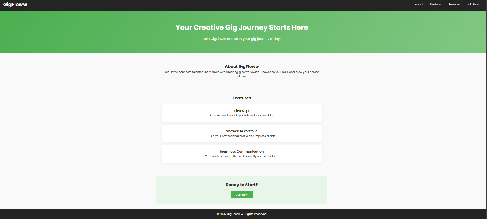

# GigFloww Landing Page

## Overview

The **GigFloww Landing Page** is a responsive and modern web page designed to showcase the features and benefits of the GigFloww platform. It is built with HTML, CSS, and JavaScript, focusing on clean design, smooth user experience, and mobile responsiveness.

### Features
- **Responsive Navigation Bar**: Includes a dropdown menu and a mobile-friendly toggle menu.
- **Hero Section**: A visually appealing header with a gradient background and a call-to-action message.
- **Feature Sections**: Highlight key features with hover effects for better interactivity.
- **Call-to-Action (CTA)**: Encourages users to take action with a prominent button.
- **Footer**: Provides essential links and information.
- **Mobile Responsiveness**: Fully optimized for various screen sizes.

### Technologies Used
- **HTML**: For the structure of the page.
- **CSS**: For styling and layout, including animations and responsiveness.
- **JavaScript**: For interactive elements like the mobile menu toggle.

### How to Use
1. Clone or download the repository.
2. Open the `index.html` file in your browser to view the landing page.
3. Customize the content and styles as needed.

### Screenshots

> Place the `screenshot.png` file in the root directory of the project.

### License
This project is open-source and available under the [MIT License](LICENSE).

---
Feel free to contribute or suggest improvements to make this project even better!
